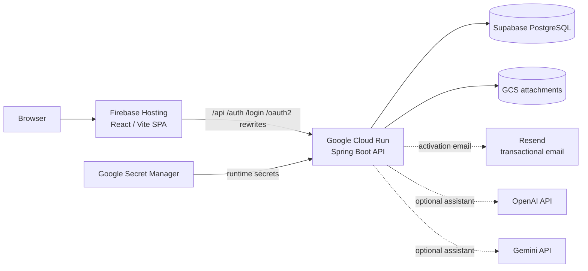
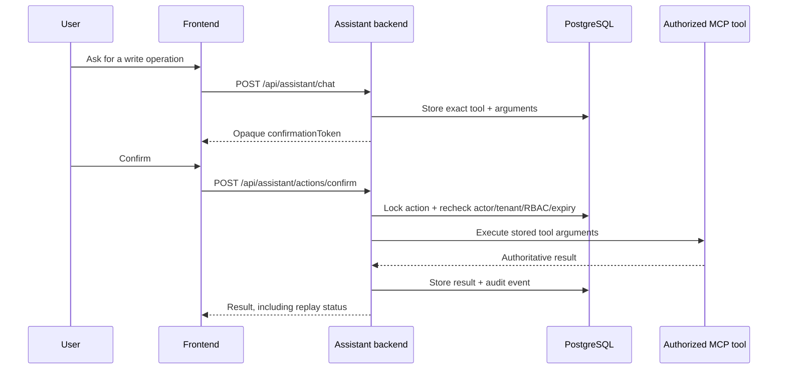

# LeaveMaestro

LeaveMaestro is a multi-tenant employee leave management application with a Spring Boot backend, a React/Refine frontend, an embedded AI assistant, and infrastructure-as-code for Google Cloud Run and Firebase Hosting.

The repository is a monorepo. Backend, frontend, infrastructure, deployment workflows, and operational documentation evolve together.

> **Documentation:** Browse the full developer and operator documentation at [thecodinganalyst.github.io/LeaveMaster](https://thecodinganalyst.github.io/LeaveMaster/).

## What LeaveMaestro provides

- Staff, tenants, locations, leave types, entitlements, calendars, approvers, applications and leave balances.
- Policy-driven leave entitlement generation with eligibility rules, deterministic policy resolution, proration, accrual, carry-forward and safe reconciliation.
- Configurable RBAC enforced on the backend for every protected operation.
- Session-based authentication plus optional Google, Microsoft, GitHub and Facebook OAuth/OIDC login for pre-provisioned users.
- First-time staff account activation with an on-demand email verification PIN instead of generated default passwords.
- Provider-neutral transactional email delivery with Resend as the initial activation-email provider.
- A React 18 frontend built with Refine, Ant Design and Vite.
- An embedded **Ask LeaveMaestro** assistant backed by Spring AI with selectable OpenAI or Gemini chat providers and the same authorized MCP tool contract used by the backend.
- Explicit confirmation, authorization re-checks, idempotency and audit logging for AI-proposed writes.
- PostgreSQL/Supabase production persistence, H2 local/test persistence and Flyway migrations.
- Google Cloud Run backend deployment, Firebase Hosting frontend deployment and Terraform-managed infrastructure.
- GitHub Actions quality gates and path-aware frontend/backend deployment workflows.

## Repository layout

```text
LeaveMaestro/
├── backend/                    # Spring Boot API, security, MCP and AI assistant
├── frontend/                   # React + Refine + Ant Design SPA
├── infra/terraform/            # GCP/Firebase infrastructure as code
├── docs/                       # Architecture, deployment, security and operator guides
├── .github/workflows/          # CI/CD and Terraform validation
├── Dockerfile                  # Production backend container build
└── docker-compose.yml          # Local PostgreSQL/backend option
```

## Architecture



Production browser traffic is intentionally same-origin. Firebase Hosting serves the SPA and rewrites backend routes to Cloud Run. This preserves CSRF/session behavior and the Firebase-compatible `__session` cookie without exposing the Cloud Run URL in the frontend bundle.

See [Architecture](docs/architecture.md) for component, security, MCP/AI and deployment diagrams.

## Technology stack

| Area | Technology |
|---|---|
| Backend | Java 25, Spring Boot 4.1, Spring Security, Spring Data JPA |
| AI / MCP | Spring AI 2.0, OpenAI or Google GenAI/Gemini, Spring AI MCP server |
| Transactional email | Provider-neutral email adapter; Resend for account activation PINs |
| Database | H2 locally/tests, PostgreSQL 17 in production |
| Migrations | Flyway |
| Frontend | React 18, TypeScript 5.9, Refine 4, Ant Design 5, Vite 7 |
| Frontend tests | Vitest, Testing Library, V8 coverage |
| Backend tests | JUnit, Spring Boot Test, Spring Security Test, JaCoCo |
| Infrastructure | Terraform, Google Cloud Run, Artifact Registry, Cloud Build, GCS, Secret Manager, Firebase Hosting |
| CI/CD | GitHub Actions + Google Workload Identity Federation |

## Quick start

### Prerequisites

- Java 25
- Node.js 22+
- npm
- Git

Gradle does not need to be installed globally; use the backend wrapper.

### 1. Start the backend

From the repository root:

```bash
./backend/gradlew bootRun
```

The local backend starts at `http://localhost:8080` using an in-memory H2 database initialized by Flyway.

Useful development endpoints:

- Swagger UI: `http://localhost:8080/swagger-ui.html`
- OpenAPI JSON: `http://localhost:8080/api-docs`
- H2 console: `http://localhost:8080/h2-console`

Default local H2 connection:

```text
JDBC URL: jdbc:h2:mem:leavemaster
User: sa
Password: <empty>
```

### 2. Start the frontend

```bash
cd frontend
cp .env.example .env.local
npm ci
npm run dev
```

The frontend starts at `http://localhost:5173`. The example local environment points it at `http://localhost:8080`.

Only non-secret browser configuration belongs in `VITE_*` variables. Never put database passwords, AI provider API keys, Resend API keys, OAuth client secrets or service-account credentials in Vite configuration.

### 3. Sign in locally

A default `PlatformAdmin` is bootstrapped when no user currently holds the `PLATFORM_ADMIN` role. Local development defaults to the password `changeme` unless `PLATFORM_ADMIN_PASSWORD` is supplied.

New staff accounts are different: staff provisioning does **not** generate a default password. The staff member starts account setup from the normal login page, requests a short-lived verification PIN by email, verifies it, and then chooses a permanent password. See [Account activation and transactional email](docs/account-activation-and-email.md).

Production uses Secret Manager and a controlled PlatformAdmin reset flow; see [Platform Admin password management](docs/platform-admin-password.md).

## Development commands

### Backend

Run from the repository root:

```bash
./backend/gradlew test
./backend/gradlew build
./backend/gradlew bootJar
```

`build` includes the configured JaCoCo verification gate. Backend code lives entirely under `backend/`.

### Frontend

Run from `frontend/`:

```bash
npm ci
npm run dev
npm run lint
npm run typecheck
npm test
npm run coverage
npm run build
npm run preview
```

The production build is emitted to `frontend/dist`.

See [Development and CI](docs/development-and-ci.md) for the complete local/test workflow.

## Authentication and authorization

LeaveMaestro uses Spring Security as the security authority. The frontend can hide or show navigation/actions based on the current user's permissions, but frontend access control is only a usability layer; every protected backend endpoint and MCP tool is still authorized server-side.

Authentication options:

- Username/password form login for activated accounts.
- First-time staff account activation by short-lived email PIN followed by permanent password setup.
- Google OAuth/OIDC.
- Microsoft Entra ID OAuth/OIDC.
- GitHub OAuth.
- Facebook Login.

For first-time staff activation, the PIN is generated only when the user explicitly selects **Send verification PIN**. Only its hash is persisted, it expires, attempts/resends are limited, and successful password setup consumes it. See [Account activation and transactional email](docs/account-activation-and-email.md) for the API, security model, Resend setup and troubleshooting.

OAuth login is restricted to existing active LeaveMaestro users whose provider identity has been mapped in the application. Provider-specific setup is documented under [`docs/idp/`](docs/idp/).

Production sessions use a `Secure`, `HttpOnly`, `SameSite=Lax` cookie named `__session` because Firebase Hosting forwards this special cookie name to Cloud Run rewrites.

See [Environments, domains, CORS and runtime secrets](docs/environments-and-domains.md).

## MCP and the embedded AI assistant

The backend exposes a Spring AI MCP server that wraps LeaveMaestro business capabilities as tools. Tool authorization is not delegated to the model: authenticated identity, tenant and authorities come from Spring Security, and existing service/method authorization remains authoritative.

The embedded **Ask LeaveMaestro** experience calls:

```text
POST /api/assistant/chat
POST /api/assistant/actions/confirm
```

The assistant reuses the MCP tool callbacks rather than maintaining a second set of business operations.

Ask LeaveMaestro can use either OpenAI or Gemini without frontend or MCP-tool changes. See [Set up Ask LeaveMaestro](docs/assistant-setup.md) for complete OpenAI and Gemini setup instructions.

### Read operations

Authorized read tools may execute during the model turn. Selected business results are also returned as structured data so the frontend can render authoritative cards separately from model-generated prose.

### Write operations

AI-proposed writes never mutate business data during the model turn. Instead:



Assistant controls include confirmation expiry, persisted idempotency, actor/tenant/RBAC revalidation, sanitized audit events, rate limits, provider timeout/retries and a circuit breaker.

See [AI assistant security and privacy](docs/assistant-security.md).

### Direct ChatGPT-to-MCP integration

Direct external ChatGPT access to LeaveMaestro MCP is **not required** for the embedded assistant. It remains a separate optional/future integration tracked by issue **#104**. The embedded assistant runs entirely through the LeaveMaestro backend and does not depend on #104.

## Production deployment

Production uses:

- Firebase Hosting for the frontend SPA.
- Cloud Run for the Spring Boot backend.
- Artifact Registry for backend images.
- Cloud Build for container builds.
- Supabase PostgreSQL for application data.
- GCS for attachments and Cloud Build staging.
- Secret Manager for database, PlatformAdmin, Resend and the selected optional AI-provider credential.
- Resend for transactional account-activation email when `EMAIL_PROVIDER=resend`.
- Terraform state in a GCS backend.
- GitHub Actions authentication to Google Cloud through Workload Identity Federation; no long-lived service-account JSON key is required.

See:

- [Cloud Run deployment](docs/cloudrun-deployment.md)
- [Account activation and transactional email](docs/account-activation-and-email.md)
- [Set up Ask LeaveMaestro](docs/assistant-setup.md)
- [Environments, domains, CORS and runtime secrets](docs/environments-and-domains.md)
- [Platform Admin password management](docs/platform-admin-password.md)

## CI/CD

GitHub Actions are path-aware so frontend-only work does not rebuild the backend and backend-only work does not redeploy Firebase Hosting.

### Backend CI

Changes under `backend/**` run the Java/Gradle workflow. It builds/tests the application, enforces JaCoCo coverage and submits dependency information.

### Frontend CI and deployment

Changes under `frontend/**` run:

```text
npm ci
lint
strict TypeScript typecheck
Vitest tests
coverage gate
Vite production build
```

Pull requests validate and build but do not deploy production. A qualifying `main` push deploys the exact validated `frontend/dist` artifact to Firebase Hosting through WIF/Application Default Credentials.

### Cloud Run deployment

Backend/infrastructure/container changes on `main` trigger the Cloud Run workflow. It:

1. authenticates with WIF;
2. initializes the production Terraform GCS backend;
3. validates/formats Terraform;
4. provisions build/runtime prerequisites;
5. builds the backend JAR and Cloud Build container image tagged with the current Git SHA;
6. creates a full Terraform plan;
7. rejects destructive changes to protected backend resources;
8. applies the plan and updates Cloud Run.

### Terraform validation

Infrastructure changes also run a standalone Terraform validation workflow before deployment.

See [Development and CI](docs/development-and-ci.md) for workflow triggers, quality gates and deployment responsibilities.

## Configuration and secrets

Local defaults are development-friendly; production is fail-closed for important runtime configuration.

Common non-secret settings include:

- `VITE_API_URL` — local frontend backend URL; leave unset for same-origin production.
- `APP_PUBLIC_URL` — canonical production app origin.
- `APP_CORS_ALLOWED_ORIGINS` — exact allowed frontend origins.
- `EMAIL_PROVIDER` — `disabled` by default; set to `resend` to deliver account activation email.
- `EMAIL_FROM_ADDRESS` / `EMAIL_FROM_NAME` — configurable transactional sender identity.
- `ASSISTANT_ENABLED` / `ASSISTANT_PROVIDER` / `ASSISTANT_MODEL` — provider-neutral assistant runtime selection.

Production secret values belong in Google Secret Manager, including:

- database password;
- PlatformAdmin bootstrap/recovery password;
- Resend API key when transactional activation email is enabled;
- OpenAI or Gemini API key for the currently selected assistant provider.

OAuth client secrets are also backend-only credentials and must never be compiled into frontend assets.

Never commit or log `RESEND_API_KEY`, and never persist/log plaintext activation PINs. See [Account activation and transactional email](docs/account-activation-and-email.md) for the current `resend.dev` development setup and optional future verified-domain setup.

When Ask LeaveMaestro is enabled, startup validation requires a supported provider, a non-blank model and only the selected provider's credential. The non-selected provider key is not required.

## API documentation

Once the backend is running:

```text
Swagger UI: http://localhost:8080/swagger-ui.html
OpenAPI:    http://localhost:8080/api-docs
```

For resource-level API notes, see [API documentation](docs/api.md). The account activation endpoints and request/response examples are documented in [Account activation and transactional email](docs/account-activation-and-email.md). For the entitlement policy, eligibility, resolution and generation workflow, see [Policy-driven leave entitlement generation](docs/leave-entitlement-generation.md).

## Documentation map

| Guide | Use it for |
|---|---|
| [Architecture](docs/architecture.md) | Components, request flows, RBAC, MCP/AI and production diagrams |
| [Development and CI](docs/development-and-ci.md) | Local setup, scripts, test gates, GitHub Actions and deployments |
| [Account activation and transactional email](docs/account-activation-and-email.md) | First-time staff activation, PIN security/lifecycle, activation APIs, Resend development setup, Secret Manager and optional custom-domain rollout |
| [Policy-driven leave entitlement generation](docs/leave-entitlement-generation.md) | Policies, eligibility, resolution, proration, accrual, carry-forward, reconciliation and generation API examples |
| [Troubleshooting](docs/troubleshooting.md) | Build, authentication, Firebase, Cloud Run, Terraform and AI failures |
| [Set up Ask LeaveMaestro](docs/assistant-setup.md) | End-to-end OpenAI and Gemini setup, provider switching, key rotation and troubleshooting |
| [AI assistant security](docs/assistant-security.md) | Confirmation, audit, redaction, rate/provider limits and AI trust boundaries |
| [Environments and domains](docs/environments-and-domains.md) | CORS, cookies, OAuth callbacks, custom domains and secrets |
| [Cloud Run deployment](docs/cloudrun-deployment.md) | One-time GCP/Supabase/WIF/Terraform deployment setup |
| [Platform Admin password](docs/platform-admin-password.md) | Secure bootstrap, reset and rotation |
| [`docs/idp/`](docs/idp/) | OAuth/OIDC provider registration |

## Troubleshooting entry points

A few production-specific rules solve many common problems:

- A newly created staff user has no password: this is expected. Start from login and use **Send verification PIN**; do not invent or recover a default password.
- Activation email is not delivered: verify `EMAIL_PROVIDER=resend`, the Secret Manager `RESEND_API_KEY` reference, sender configuration and Resend delivery status without logging the PIN/key.
- A login that succeeds but `/auth/me` returns `401`: verify the Cloud Run session cookie is named `__session`.
- Firebase shows **Site Not Found**: provisioning the site is not the same as deploying `frontend/dist`; check the frontend deployment workflow.
- Cloud Run reports an image tag not found: verify Cloud Build pushed the current Git SHA and do not rely on stale state-backed image outputs after targeted Terraform applies.
- The assistant returns `503`: confirm it is enabled, the provider/model settings agree, and the selected OpenAI or Gemini Secret Manager key is attached to Cloud Run.
- CORS fails locally: use the documented `http://localhost:5173` frontend origin and `VITE_API_URL=http://localhost:8080`.

See [Troubleshooting](docs/troubleshooting.md) and [Account activation and transactional email](docs/account-activation-and-email.md) for detailed checks.
