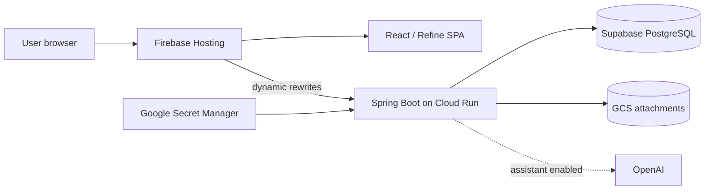
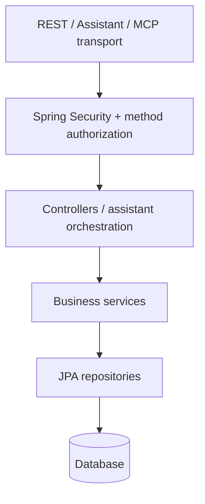
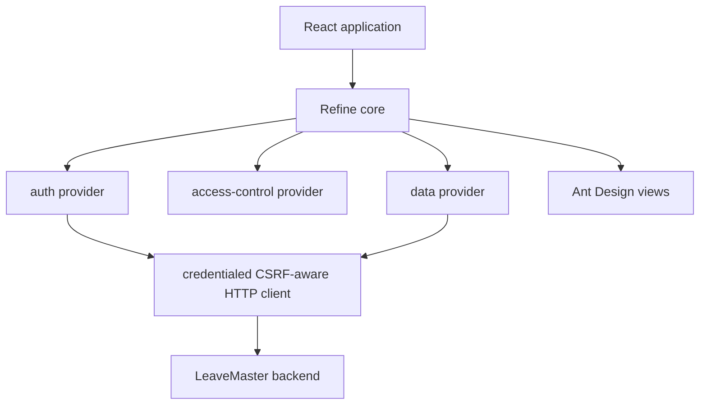
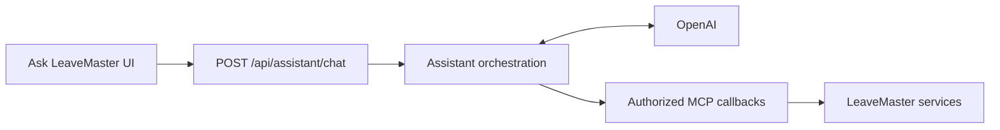
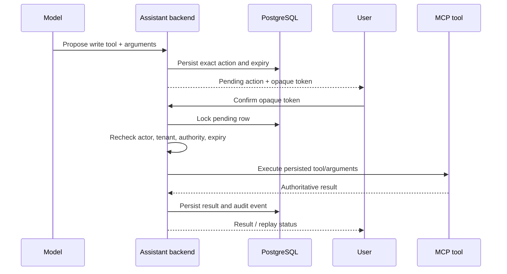
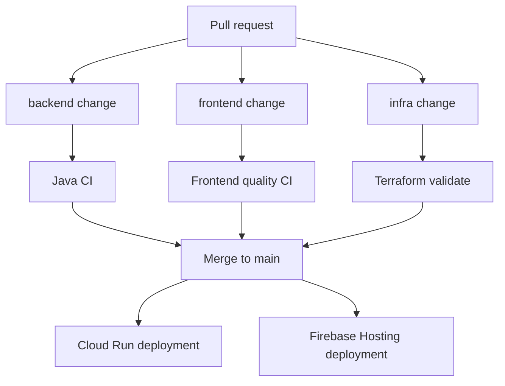

# LeaveMaster architecture

This document describes the deployed LeaveMaster architecture, security boundaries and the relationship between the REST API, MCP tools and embedded AI assistant.

## System context



Firebase Hosting is the canonical production browser origin. It serves the Vite build and rewrites backend paths such as `/api/**`, `/auth/**`, `/account-activation/**`, `/logout`, `/oauth2/**` and `/login/oauth2/**` to the Cloud Run service.

This design keeps browser authentication same-origin. The Cloud Run profile uses the Firebase-supported `__session` cookie with `Secure`, `HttpOnly` and `SameSite=Lax` attributes. The complete rewrite contract, SPA fallback behavior and maintenance checklist are documented in `docs/firebase-hosting-routing.md`.

## Monorepo boundaries

```text
backend/
  Spring MVC REST API
  Spring Security / RBAC
  JPA + Flyway
  MCP server and tool callbacks
  embedded Spring AI assistant

frontend/
  React 18 SPA
  Refine resource/data/auth/access-control providers
  Ant Design presentation
  Ask LeaveMaster drawer
  Firebase Hosting configuration

infra/terraform/
  Google/Firebase resources
  Cloud Run runtime configuration
  Secret references and IAM
  outputs used by deployment/operations

.github/workflows/
  backend CI
  frontend CI + Firebase deployment
  Terraform validation
  Cloud Run deployment
```

## Backend layers

The backend follows a conventional Spring application structure:



Business authorization remains server-side regardless of which caller invokes the operation. A hidden frontend button is not a security control; backend endpoint and tool permissions are authoritative.

## Authentication and RBAC

LeaveMaster supports local form login and optional OAuth/OIDC providers. Authentication creates a Spring Security session. The authenticated user is loaded from `app_user`, and effective authorities come from active roles and their permissions.

The frontend consumes authenticated-user/permission information to implement navigation and action visibility through Refine's access-control layer. That is a UX optimization only. Direct API access still goes through Spring Security authorization.

Typical permission groups include tenant, user, role, staff, jurisdiction, leave-type, approver, calendar, entitlement-policy and leave-application read/write/approval authorities. Jurisdiction is the sole geographic model; the former Location module and its permissions have been removed.

OAuth providers are restricted to existing active LeaveMaster users mapped to an IdP provider/subject. Production callbacks use the canonical frontend origin and are rewritten through Firebase Hosting to Cloud Run.

## Frontend architecture



The HTTP layer includes credentials on requests and obtains/refreshes CSRF tokens for unsafe methods. Production uses a relative API base; local development uses `VITE_API_URL=http://localhost:8080`.

## MCP server

The backend exposes LeaveMaster business operations as Spring AI MCP tools. MCP is a tool contract over existing application behavior, not a bypass around the service/security layers.

Key security properties:

- authenticated identity comes from Spring Security, not model/tool arguments;
- tenant context is server-resolved and explicit tenant arguments are checked;
- tools remain constrained by the user's current authorities;
- business/method authorization still applies when a tool is invoked;
- sensitive credentials are never part of the MCP contract.

The MCP server can support external integrations in the future, but direct ChatGPT-to-MCP access tracked in issue #104 is optional and is not required by the embedded assistant.

## Embedded Ask LeaveMaster assistant

The embedded assistant uses Spring AI/OpenAI server-side and reuses the MCP tool callback provider.



The model is treated as an untrusted planner. It cannot grant itself authority or choose a trusted tenant/identity.

### Read flow

1. Backend resolves the authenticated actor, tenant and authorities.
2. Only authorized tools are exposed for the request.
3. The model may request a read tool.
4. The existing authorized MCP callback executes.
5. The result is returned to the model; selected business read results can also be exposed as `structuredResults` for authoritative frontend rendering.
6. Audit metadata is persisted.

### Write flow

Writes, approvals and destructive operations require explicit human confirmation.



The browser does not resubmit editable tool arguments during confirmation. Retries/double-clicks cannot execute the same persisted action twice; an executed token replays the stored result.

See `docs/assistant-security.md` for confirmation TTL, redaction, audit, rate limits, provider retries/timeouts and circuit-breaker behavior.

## Data and storage

### Local/test

- H2 in-memory database.
- Flyway migrations initialize schema.
- Local filesystem attachment directory where configured.

### Production

- Supabase PostgreSQL via SSL session/direct-compatible connection.
- Flyway validates/applies migrations during backend startup.
- GCS attachment bucket.
- Database-backed assistant pending actions and audit events.

## Production infrastructure

Terraform manages or references:

- required GCP APIs;
- Artifact Registry repository;
- Cloud Build source bucket;
- Cloud Run runtime service account;
- Cloud Run service and public invoker binding;
- attachment bucket/IAM;
- database-password Secret Manager resource/IAM;
- PlatformAdmin password secret/IAM;
- optional existing OpenAI secret/IAM/runtime binding;
- Firebase project association and Hosting site;
- canonical app URL and CORS runtime configuration.

Secret **values** are not committed to Terraform. Runtime credentials are supplied using Secret Manager versions and Cloud Run secret references.

## Deployment paths



Path filters prevent unrelated deployments. Frontend PR CI never deploys production; production Firebase deployment occurs only on an eligible `main` run. Backend/infra/container changes drive the Cloud Run/Terraform path.

## Trust boundaries

| Boundary | Rule |
|---|---|
| Browser vs backend | Never trust hidden UI state or browser-supplied authority/tenant claims |
| AI model vs application | Model is an untrusted planner; server resolves actor/tenant/permissions |
| Frontend config vs secrets | `VITE_*` is public; secrets are backend-only |
| GitHub vs Google Cloud | WIF uses short-lived credentials; no committed service-account key |
| Terraform vs secret values | Terraform manages secret resources/bindings, not plaintext runtime values |
| Firebase vs Cloud Run session | Use same-origin rewrites and the `__session` cookie |

## Related guides

- `docs/firebase-hosting-routing.md`
- `docs/development-and-ci.md`
- `docs/assistant-security.md`
- `docs/environments-and-domains.md`
- `docs/cloudrun-deployment.md`
- `docs/troubleshooting.md`
