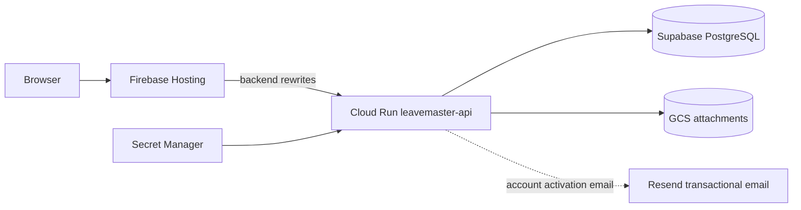

# Cloud Run and Firebase production deployment

This guide describes the current LeaveMaster production deployment: Spring Boot on Google Cloud Run, React/Vite on Firebase Hosting, Supabase PostgreSQL, Terraform-managed GCP/Firebase infrastructure, Secret Manager runtime credentials and GitHub Actions authentication through Workload Identity Federation (WIF).

For architecture and local development, start with `README.md`, `docs/architecture.md` and `docs/development-and-ci.md`. For first-time staff activation and transactional email, see [`docs/account-activation-and-email.md`](account-activation-and-email.md).

## Production topology



Browser traffic stays on the Firebase/custom frontend origin. Do not configure the production Vite bundle to call the `run.app` hostname directly.

## Prerequisites

- Google Cloud project with billing enabled.
- Supabase PostgreSQL project.
- GitHub repository/environment access.
- Google Cloud CLI for one-time bootstrap/secret versions.
- Terraform >= 1.8 if performing bootstrap/import work locally.
- Firebase terms accepted for the Google account/project when first enabling Firebase.

Current production defaults use region `asia-southeast1`.

## Supabase

Create a Supabase PostgreSQL project in a nearby region and use a direct/session-mode compatible connection on port 5432. Do not use transaction-pooler port 6543 for Flyway migrations.

Record the non-secret connection values for GitHub environment variables:

```text
SUPABASE_DB_HOST
SUPABASE_DB_USERNAME
```

Database password is a secret and belongs in Google Secret Manager.

## Terraform state bucket

Create the remote state bucket once, for example:

```bash
PROJECT_ID=YOUR_PROJECT_ID
REGION=asia-southeast1

gcloud storage buckets create "gs://${PROJECT_ID}-tfstate" \
  --location="${REGION}" \
  --uniform-bucket-level-access
```

The production workflow initializes this bucket with prefix:

```text
leavemaster/production
```

Always use the same backend when importing or troubleshooting production Terraform state.

## GitHub Actions service account and WIF

Create a deployment service account and configure GitHub OIDC/WIF so Actions can impersonate it without a long-lived JSON key.

The WIF provider should map repository identity and restrict the provider to the intended repository. Grant the repository principal `roles/iam.workloadIdentityUser` on the deployment service account.

The deployment account needs the project/IAM/storage/Secret Manager/Firebase permissions required by the Terraform/workflow resources. Firebase administration belongs on the deployment identity, not the Cloud Run runtime identity.

The GitHub workflow requires:

```yaml
permissions:
  contents: read
  id-token: write
```

Do not commit a service-account key as a fallback.

## Database password secret

Terraform manages the `leavemaster-db-password` secret resource and Cloud Run access binding, but not the plaintext value.

Add the first secret version before a Cloud Run revision references it:

```bash
printf '%s' 'YOUR_SUPABASE_DB_PASSWORD' | \
  gcloud secrets versions add leavemaster-db-password \
    --data-file=- \
    --project=YOUR_PROJECT_ID
```

If the secret resource does not exist yet, run the prerequisite Terraform deployment first or create/import it according to the production state plan.

## PlatformAdmin password secret

Production can source `PLATFORM_ADMIN_PASSWORD` from:

```text
leavemaster-platform-admin-password
```

The password value is plaintext inside Secret Manager; Spring BCrypt-hashes it before storing a password hash in PostgreSQL.

Use the controlled recovery/rotation process in `docs/platform-admin-password.md`. Normally:

```text
ENABLE_PLATFORM_ADMIN_PASSWORD_SECRET=true
RESET_PLATFORM_ADMIN_PASSWORD=false
```

The reset flag should be set to `true` only for the deliberate recovery deployment and returned to `false` immediately afterward.

## Resend activation-email secret

First-time staff account activation can send verification PINs through Resend. The Java application is provider-neutral, but the current provider adapter is enabled with:

```text
EMAIL_PROVIDER=resend
EMAIL_FROM_ADDRESS=onboarding@resend.dev
EMAIL_FROM_NAME=LeaveMaster
```

The Resend API key belongs in Secret Manager. Terraform expects an existing secret ID through `resend_api_key_secret_id`; the current default is:

```text
leavemaster-resend-api-key
```

Create the secret and first version if needed:

```bash
printf '%s' 'YOUR_RESEND_API_KEY' | \
  gcloud secrets create leavemaster-resend-api-key \
    --data-file=- \
    --replication-policy=automatic \
    --project=YOUR_PROJECT_ID
```

Rotate an existing key by adding a version:

```bash
printf '%s' 'YOUR_NEW_RESEND_API_KEY' | \
  gcloud secrets versions add leavemaster-resend-api-key \
    --data-file=- \
    --project=YOUR_PROJECT_ID
```

Terraform grants the Cloud Run runtime service account secret access and injects the value as secret-backed `RESEND_API_KEY`. Never put the plaintext key in GitHub variables, Terraform variable files, application configuration, logs or Vite/frontend settings.

A custom sending domain is not required for current development/testing. `onboarding@resend.dev` is supported as the development sender. Treat `resend.dev` as test/development usage rather than unrestricted production delivery.

No GoDaddy or other registrar mailbox/email-hosting subscription is required merely to send outbound transactional email through Resend. When a production sending identity is needed later, verify a domain/subdomain in Resend and change `EMAIL_FROM_ADDRESS`; no application code change is required.

See [`docs/account-activation-and-email.md`](account-activation-and-email.md) for activation API behaviour, PIN security, smoke testing and custom-domain rollout.

## OpenAI assistant secret

The assistant is disabled by default. Production expects an existing Secret Manager secret, default:

```text
leavemaster-openai-api-key
```

Create the secret and first version if needed:

```bash
printf '%s' 'YOUR_OPENAI_API_KEY' | \
  gcloud secrets create leavemaster-openai-api-key \
    --data-file=- \
    --replication-policy=automatic \
    --project=YOUR_PROJECT_ID
```

Rotate an existing key by adding a version:

```bash
printf '%s' 'YOUR_NEW_OPENAI_API_KEY' | \
  gcloud secrets versions add leavemaster-openai-api-key \
    --data-file=- \
    --project=YOUR_PROJECT_ID
```

The current Terraform configuration manages the Cloud Run secret-accessor binding and secret-backed `OPENAI_API_KEY` environment reference when the assistant is enabled. Do **not** run an ad-hoc `gcloud run services update` to maintain assistant configuration; Terraform is now authoritative.

Enable through GitHub production environment variables:

```text
ENABLE_OPENAI_ASSISTANT=true
OPENAI_API_KEY_SECRET_ID=leavemaster-openai-api-key
OPENAI_MODEL=gpt-5-mini
```

The deployment also sets the Spring AI model selector for the enabled assistant. The secret value never belongs in GitHub variables, Terraform state or Vite configuration.

## Firebase Hosting

The same GCP project is associated with Firebase. Terraform can enable required Firebase services and create the environment-specific Hosting site when:

```text
ENABLE_FIREBASE_HOSTING=true
FRONTEND_ENVIRONMENT=production
```

Default site ID convention:

```text
<project-id>-<frontend-environment>
```

For project `leavemaster` and environment `production`:

```text
leavemaster-production
```

The corresponding default app origin is:

```text
https://leavemaster-production.firebaseapp.com
```

Provisioning the site does **not** deploy the React application. The frontend GitHub Actions workflow builds `frontend/dist` and publishes it after an eligible `main` push.

## Production Hosting rewrites

`frontend/firebase.json` sends browser-facing backend paths to the Cloud Run service before the SPA fallback, including:

```text
/api/**
/auth/**
/oauth2/**
/login/oauth2/**
/login
/logout
```

All other frontend routes fall back to `index.html` for React Router.

The Cloud Run session cookie is named `__session` because Firebase Hosting forwards this specially named cookie to the dynamic backend. It is `Secure`, `HttpOnly` and `SameSite=Lax`.

## GitHub production environment

Create/protect a GitHub environment named `production`.

Core deployment variables include:

```text
GCP_PROJECT_ID
GCP_REGION
SUPABASE_DB_HOST
SUPABASE_DB_USERNAME
TF_STATE_BUCKET
WIF_PROVIDER
WIF_SERVICE_ACCOUNT
ENABLE_FIREBASE_HOSTING
FRONTEND_ENVIRONMENT
ENABLE_PLATFORM_ADMIN_PASSWORD_SECRET
RESET_PLATFORM_ADMIN_PASSWORD
```

Current runtime/environment options include:

```text
PUBLIC_APP_URL
ALLOWED_FRONTEND_ORIGINS
EMAIL_PROVIDER
EMAIL_FROM_ADDRESS
EMAIL_FROM_NAME
RESEND_API_KEY_SECRET_ID
ENABLE_OPENAI_ASSISTANT
OPENAI_API_KEY_SECRET_ID
OPENAI_MODEL
```

`RESEND_API_KEY_SECRET_ID` identifies the Secret Manager secret; the API key value itself must not be stored as a GitHub variable.

See `docs/environments-and-domains.md` for exact semantics and custom-domain/OAuth requirements.

## Cloud Run deployment workflow

The backend production workflow runs on eligible `main` changes and manual dispatch.

High-level flow:

1. Checkout repository.
2. Authenticate to Google Cloud through WIF.
3. Initialize Terraform against the production GCS backend.
4. Run Terraform format/validation checks.
5. Perform targeted prerequisite provisioning for APIs, buckets, registry, service accounts, managed secrets/IAM, Firebase resources and optional provider bindings.
6. Build `backend` with Gradle `bootJar`.
7. Build/push the production container using Cloud Build.
8. Tag the container with the current Git commit SHA.
9. Generate the full Terraform plan with Cloud Run enabled.
10. Run the protected-resource plan check.
11. Apply the plan.
12. Print the Cloud Run URL for operator diagnostics.

### Current image tag rule

The workflow constructs the container URI from current deployment variables and `${github.sha}`. It does not read the mutable image tag from Terraform state after the targeted prerequisite apply because state-backed outputs can be stale/incomplete in that phase.

If Cloud Run reports:

```text
Image ...:<sha> not found
```

verify Artifact Registry contains the exact SHA from that workflow run.

## Frontend deployment workflow

Frontend pull requests run the complete quality gate but do not deploy production.

An eligible `main` push runs:

```text
npm ci
npm run lint
npm run typecheck
npm test
npm run coverage
npm run build
```

The validated `frontend/dist` artifact is then deployed to Firebase Hosting using WIF/Application Default Credentials. No `FIREBASE_TOKEN` or service-account JSON key is required.

## Terraform production resources

The Terraform layout under `infra/terraform/` covers:

- required project APIs;
- Artifact Registry;
- Cloud Build source bucket;
- Cloud Run service account/service/public IAM;
- attachment bucket/runtime IAM;
- database secret resource/runtime IAM;
- PlatformAdmin secret resource/runtime IAM;
- existing Resend secret lookup/runtime IAM and secret-backed `RESEND_API_KEY` injection when email is enabled;
- optional existing OpenAI/Gemini secret lookup/runtime IAM;
- Firebase project association and Hosting site;
- runtime public URL/CORS/email/assistant settings;
- deployment outputs.

Before applying manually, understand the production remote state and GitHub-provided variables. Do not create a second local production state.

## Protected Terraform plans

The Cloud Run workflow runs `check-protected-plan.sh` before applying the full plan. A destructive action against protected backend resources fails the workflow.

Do not bypass this check to fix a state/configuration mismatch. Inspect resource addressing, conditionals/counts and imports first.

## Custom domains

Firebase Hosting can own the browser custom domain/TLS, for example `app.example.com`. When changing the canonical app origin:

1. configure/verify the Firebase custom domain and DNS;
2. set `PUBLIC_APP_URL=https://app.example.com`;
3. set exact `ALLOWED_FRONTEND_ORIGINS` as needed;
4. update OAuth callback registrations to the new origin;
5. deploy Cloud Run and Firebase Hosting.

A separate API domain is optional and is not needed for the browser session flow.

The **email sending domain is independent** from the browser custom domain. A custom email domain/subdomain is optional until production transactional delivery is required; see [`docs/account-activation-and-email.md`](account-activation-and-email.md). Buying a mailbox from the registrar is not required for Resend outbound delivery.

## OAuth callbacks

Production callback URLs use the canonical public app origin:

```text
https://<app-origin>/login/oauth2/code/google
https://<app-origin>/login/oauth2/code/microsoft
https://<app-origin>/login/oauth2/code/github
https://<app-origin>/login/oauth2/code/facebook
```

Firebase rewrites the callback to Cloud Run. Successful authentication returns the browser to the app.

## Post-deployment verification

Verify:

1. Firebase site loads the expected frontend release.
2. Login succeeds and `/auth/me` returns `200` afterward.
3. Browser session cookie is `__session` and secure/HttpOnly.
4. Browser API traffic stays on the Firebase/custom app host.
5. Backend health/application logs show successful database/Flyway startup.
6. CORS rejects unapproved direct browser origins.
7. OAuth callbacks use the canonical app origin if providers are enabled.
8. If Resend email is enabled, Cloud Run contains a secret-backed `RESEND_API_KEY` reference and a controlled activation smoke test can request email without exposing the PIN/key in logs.
9. If assistant is enabled, Cloud Run contains the selected provider's secret-backed API key and `/api/assistant/chat` works for an authorized user.
10. Terraform outputs show the expected app URL/origin configuration.

## Troubleshooting

See `docs/troubleshooting.md` for Firebase Site Not Found, session `401`, Cloud Run image mismatch, Flyway, Terraform state/import, WIF and assistant-provider failures. See [`docs/account-activation-and-email.md`](account-activation-and-email.md) for Resend configuration, sender/domain rejection, activation PIN delivery, expiry and rate-limit troubleshooting.
