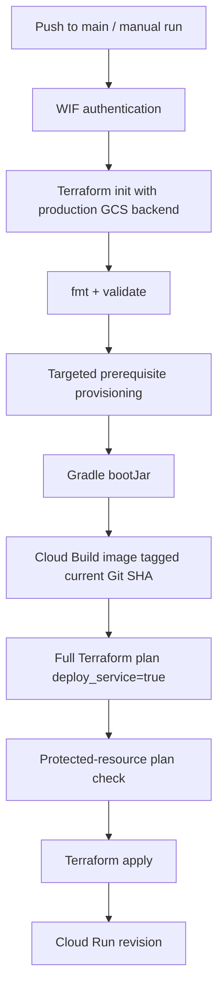

# Development and CI/CD

This guide is the contributor/operator reference for running, testing and deploying the LeaveMaster monorepo.

## Local development

### Prerequisites

- Java 25
- Node.js 22+
- npm
- Git

Optional depending on task:

- Docker / Docker Compose
- Google Cloud CLI
- Terraform >= 1.8
- Firebase CLI for manual Hosting inspection

## Backend

The backend lives under `backend/` and uses the included Gradle wrapper.

Run locally with H2:

```bash
./backend/gradlew bootRun
```

Build and test:

```bash
./backend/gradlew test
./backend/gradlew build
./backend/gradlew bootJar
```

`build` includes the configured JaCoCo coverage verification gate.

Useful endpoints while running locally:

```text
http://localhost:8080/swagger-ui.html
http://localhost:8080/api-docs
http://localhost:8080/h2-console
```

The local H2 database uses:

```text
jdbc:h2:mem:leavemaster
user: sa
password: <empty>
```

### Backend configuration

Local configuration defaults are in `backend/src/main/resources/application.yaml`. The production-specific Cloud Run profile is in `application-cloudrun.yaml`.

Secrets should be provided through process environment variables locally and Secret Manager in production. Do not commit local secret files or place credentials in YAML.

Important local-only or optional variables include:

```text
PLATFORM_ADMIN_PASSWORD
GOOGLE_CLIENT_ID / GOOGLE_CLIENT_SECRET
MICROSOFT_CLIENT_ID / MICROSOFT_CLIENT_SECRET / MICROSOFT_TENANT_ID
GH_CLIENT_ID / GH_CLIENT_SECRET
FACEBOOK_CLIENT_ID / FACEBOOK_CLIENT_SECRET
ASSISTANT_ENABLED
SPRING_AI_MODEL_CHAT
OPENAI_API_KEY
OPENAI_MODEL
```

The assistant is disabled by default.

## Frontend

The frontend lives under `frontend/`.

First setup:

```bash
cd frontend
cp .env.example .env.local
npm ci
```

Run development server:

```bash
npm run dev
```

The local frontend runs at `http://localhost:5173` and `.env.example` points `VITE_API_URL` at `http://localhost:8080`.

### Frontend scripts

```bash
npm run dev
npm run lint
npm run typecheck
npm test
npm run coverage
npm run build
npm run preview
npm run format
```

`npm run build` runs TypeScript project compilation before Vite and emits production assets to `frontend/dist`.

### Frontend architecture

The SPA uses:

- React 18 and React Router;
- Refine core for resources/data/auth/access-control orchestration;
- Ant Design for the UI;
- a custom credentialed/CSRF-aware HTTP layer;
- Vitest + Testing Library for frontend tests.

Production should normally leave `VITE_API_URL` unset so API requests remain relative to the Firebase Hosting origin and are rewritten to Cloud Run.

Never put secrets in `VITE_*`; Vite compiles those values into browser-visible JavaScript.

## Running backend + frontend together

Terminal 1:

```bash
./backend/gradlew bootRun
```

Terminal 2:

```bash
cd frontend
npm ci
npm run dev
```

Then open:

```text
http://localhost:5173
```

The local CORS allowlist defaults to that frontend origin.

## Docker Compose option

To exercise the backend with PostgreSQL locally:

```bash
./backend/gradlew bootJar
POSTGRES_PASSWORD=secret docker compose up --build
```

Do not treat Docker Compose credentials as production secrets.

## Tests and quality gates

### Backend gate

The Gradle build validates:

- compilation;
- unit/integration/Spring Security tests;
- JUnit platform execution;
- JaCoCo report generation;
- JaCoCo coverage verification.

Changes that affect authentication, RBAC, assistant security, tenant isolation or migrations should include focused tests in addition to general build coverage.

### Frontend gate

The frontend CI gate runs:

```text
npm ci
npm run lint
npm run typecheck
npm test
npm run coverage
npm run build
```

Coverage uses the configured Vitest/V8 thresholds. Do not lower thresholds simply to make a change pass; add tests for the changed behavior.

Important frontend test areas include:

- API/data-provider mappings;
- CSRF/session HTTP behavior;
- authentication/session expiry;
- RBAC/access-control decisions;
- leave workflows;
- Ask LeaveMaster structured reads and confirmation behavior.

## GitHub Actions model

The workflows are path-aware.

### Java CI with Gradle

Triggered by backend changes. Responsibilities include:

- Java 25 setup;
- Gradle build/test/coverage;
- JaCoCo artifact/report handling;
- dependency graph submission.

Frontend-only changes should not run this workflow.

### Frontend CI and Firebase Hosting

Triggered by frontend changes.

On pull requests it validates quality and produces the exact `frontend/dist` artifact, but it does **not** deploy production.

On an eligible `main` push it:

1. runs the full frontend quality gate;
2. authenticates to Google Cloud through the existing WIF identity;
3. deploys the validated build to the configured Firebase Hosting site.

No legacy Firebase token or service-account JSON key is required.

### Terraform Validate

Triggered for Terraform/infrastructure changes. It verifies formatting/init/validation independently from the production deployment workflow.

### Deploy to Cloud Run

Triggered by backend, Terraform, Docker/container or deployment-workflow changes on `main`, and can also be started manually.

High-level flow:



The current image URI is constructed from the deployment variables and current Git SHA rather than read from a potentially stale state output after targeted Terraform operations.

The protected-plan check refuses Terraform plans that would delete/replace critical backend resources such as Cloud Run, service accounts, Artifact Registry, storage buckets or managed secrets.

## Terraform working model

Terraform lives under `infra/terraform/`.

Production state is remote in GCS. GitHub Actions initializes the backend with the production bucket and prefix before planning/applying.

Terraform manages infrastructure declarations and Secret Manager bindings, not plaintext secret values.

Typical local validation:

```bash
cd infra/terraform
terraform fmt -check -recursive
terraform init -backend=false
terraform validate
```

For actual production state/plan work, use the documented remote backend and production variables rather than a local ad-hoc state.

## Production GitHub environment

Production deployment settings belong in the GitHub `production` environment. Current core variables include GCP project/region, Supabase host/user, Terraform state bucket, WIF provider/service account, Firebase settings and runtime feature toggles.

See `docs/environments-and-domains.md` for the authoritative list and meanings.

Secret **values** do not belong in GitHub environment variables. Database, PlatformAdmin and OpenAI secret values belong in Google Secret Manager.

## Production deployment ownership

| Concern | Owner |
|---|---|
| Frontend static release | Firebase Hosting workflow |
| Backend image build | Cloud Build through Cloud Run workflow |
| Backend runtime | Terraform / Cloud Run |
| Database schema | Flyway at backend startup |
| Runtime secret values | Google Secret Manager |
| Runtime secret bindings/IAM | Terraform |
| DNS for custom domain | Domain/DNS provider + Firebase verification |
| TLS for Firebase custom domain | Firebase Hosting |
| OAuth callback registration | External IdP configuration |

## Safe contribution workflow

1. Branch from current `main`.
2. Make the smallest coherent change.
3. Run relevant local checks where practical.
4. Open a PR.
5. Let path-specific CI finish.
6. Review any infrastructure plan implications separately from application tests.
7. Merge only after required checks pass.
8. For runtime/configuration work, observe the corresponding `main` deployment workflow and verify production behavior.

## Related guides

- `docs/architecture.md`
- `docs/environments-and-domains.md`
- `docs/cloudrun-deployment.md`
- `docs/assistant-security.md`
- `docs/troubleshooting.md`
