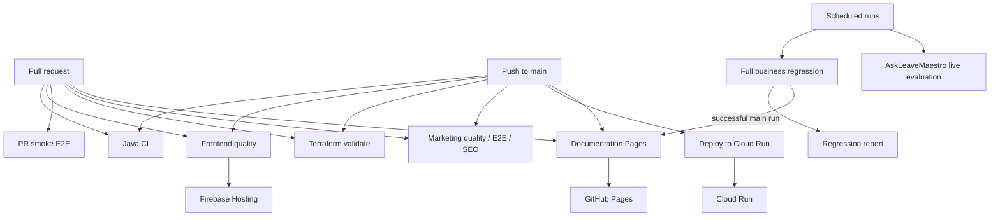

# GitHub Actions workflow reference

This page is the operator and contributor reference for every workflow in `.github/workflows/`. Use it to understand **why a workflow exists, when it runs, what it validates or changes, and what output to inspect**.

!!! warning "Production-changing workflows"
    **Deploy to Cloud Run**, **Frontend CI and Firebase Hosting** (deployment job), **Documentation Pages**, and **Restrict Cloud Run Access** can change deployed services or published sites. Review the target environment and variables before manually starting them. **Restrict Cloud Run Access** deliberately removes public invocation from the production Cloud Run service.

## At a glance

| Workflow | File | Runs automatically | Manual | Production side effect |
| --- | --- | --- | --- | --- |
| AskLeaveMaestro live Gemini evaluation | `assistant-live-evaluation.yml` | PR validation; daily schedule | Yes | No; calls deployed API during live evaluation |
| Deploy to Cloud Run | `deploy-cloud-run.yml` | Push to `main` for backend/infra/container changes | Yes | **Yes — backend/infrastructure** |
| Documentation Pages | `docs-pages.yml` | Docs PR/push; successful full regression | Yes | **Yes — GitHub Pages** |
| End-to-end PR smoke tests | `e2e.yml` | Relevant PRs | Yes | No |
| Frontend CI and Firebase Hosting | `frontend-quality.yml` | Relevant PRs and `main` pushes | Yes | **Yes on main/manual — Firebase Hosting** |
| Full business regression | `full-regression.yml` | Daily schedule; relevant PRs | Yes | No |
| Java CI with Gradle | `gradle.yml` | Backend PRs and `main` pushes | No | No |
| Marketing calculator E2E | `marketing-e2e.yml` | Relevant PRs and `main` pushes | No | No |
| Marketing CI | `marketing-quality.yml` | Relevant PRs and `main` pushes | Yes | No |
| Marketing SEO CI | `marketing-seo-ci.yml` | Relevant PRs and `main` pushes | No | No |
| Restrict Cloud Run Access | `restrict-cloud-run-access.yml` | No | **Yes only** | **Yes — removes public access** |
| Terraform Validate | `terraform-validate.yml` | Terraform PRs and `main` pushes | No | No |

## How the workflows fit together

Path filters mean a PR normally runs only the checks relevant to files it changes. A documentation-only change, for example, should not cause a backend deployment.

## AskLeaveMaestro live Gemini evaluation

**File:** `.github/workflows/assistant-live-evaluation.yml`

**Purpose.** Validate the live AskLeaveMaestro evaluator and periodically exercise the configured AI model against a deployed LeaveMaestro API.

**Triggers.** On PRs to `main` that change the evaluator, workflow, or evaluator documentation; manually with `workflow_dispatch`; and daily at `18:30 UTC` (02:30 Singapore time the following day).

On PRs it runs only the **validate** job: Node syntax validation plus checks that the scenario catalogue is non-empty and contains critical and tenant-isolation scenarios. It does **not** call the deployed assistant.

Scheduled/manual runs execute **live-evaluation** against `inputs.base_url`, `ASSISTANT_LIVE_EVAL_BASE_URL`, or the configured default API URL. The evaluator allows two attempts, writes its Markdown report into the workflow summary, and uploads `askleavemaestro-live-evaluation-<run id>` for 30 days.

**Manual use.** Run it when you want to verify the deployed assistant/model outside the daily schedule, particularly after changing model/provider configuration. Supplying `base_url` lets you target another deployed API.

## Deploy to Cloud Run

**File:** `.github/workflows/deploy-cloud-run.yml`

**Purpose.** Build the backend container and reconcile the production Google Cloud infrastructure and Cloud Run service through Terraform.

**Triggers.** Pushes to `main` affecting `backend/**`, `infra/terraform/**`, the root Docker files, or this workflow; and manual dispatch.

The single production **deploy** job:

1. authenticates to Google Cloud with Workload Identity Federation;
2. initializes the production Terraform GCS backend;
3. checks Terraform formatting and validation;
4. applies targeted prerequisite resources needed to build/host;
5. builds the Spring Boot JAR;
6. builds and pushes a container tagged with the current Git SHA using Cloud Build;
7. creates a full Terraform plan with `deploy_service=true`;
8. runs `check-protected-plan.sh` to reject destructive changes to protected backend resources;
9. applies the saved plan;
10. prints the resulting Cloud Run URL.

It uses the GitHub `production` environment and repository/environment variables including GCP/WIF, Terraform state, Supabase, frontend origins, assistant/provider, email, OAuth and Firebase configuration. Secret **values** remain in Google Secret Manager; Terraform receives secret IDs/bindings rather than plaintext application secrets.

**Manual use.** Use manual dispatch when production must be reconciled/redeployed without an eligible `main` path change. This workflow changes production infrastructure and application revisions; inspect configuration before running it.

## Documentation Pages

**File:** `.github/workflows/docs-pages.yml`

**Purpose.** Strictly build the MkDocs documentation and publish the documentation site, including the latest successful full-regression report.

**Triggers.** Relevant docs/config/README PRs and `main` pushes, manual dispatch, and completion of **Full business regression**.

Every eligible run builds with `mkdocs build --strict`. PR runs stop after validation and do not publish. Non-PR runs locate a successful full regression, download its `scenario-coverage-full-regression` artifact, publish the HTML/JSON/Markdown report into the Pages output, verify report routes, upload the Pages artifact, and deploy through the `github-pages` environment.

A `workflow_run` event only proceeds when the full regression succeeded on `main` and was not itself a PR run. This prevents a failed regression or PR regression from replacing the published report.

**Manual use.** Run it to republish current documentation/report when no qualifying docs push occurred. Publishing requires a successful full-regression artifact.

## End-to-end PR smoke tests

**File:** `.github/workflows/e2e.yml`

**Purpose.** Give relevant PRs a fast business-flow integration gate across backend, frontend, and Playwright.

**Triggers.** PRs to `main` affecting frontend/backend/testing scenario assets or the E2E/regression workflows; and manual dispatch.

The workflow runs backend tests plus JaCoCo verification, the backend `smokeTest` catalogue, starts an isolated backend with the `e2e` profile, runs frontend unit tests and coverage, installs Chromium, and executes `npm run test:smoke`.

It always generates and uploads the business scenario coverage report (30-day retention), Playwright report and backend test reports (14 days). On failures it also uploads Playwright failure artifacts and the isolated backend log.

**Manual use.** Run it when you need to reproduce the complete PR smoke gate even if path filters would not trigger it.

## Frontend CI and Firebase Hosting

**File:** `.github/workflows/frontend-quality.yml`

**Purpose.** Validate the application frontend and deploy the exact validated build to production Firebase Hosting.

**Triggers.** Frontend-related PRs to `main`, frontend-related pushes to `main`, and manual dispatch.

The **quality** job runs `npm ci`, lint, TypeScript checks, unit tests, coverage enforcement, and a production build. It uploads frontend coverage for 14 days and `frontend-dist` for seven days.

The **deploy-production** job runs only for a push or manual dispatch and depends on successful quality. It downloads the previously validated `frontend-dist`, authenticates with WIF, derives/configures the Firebase Hosting site, and deploys using Firebase CLI. PRs therefore validate but never deploy production.

**Manual use.** A manual run performs both quality and production deployment. Use it only when you intend to redeploy Firebase Hosting.

## Full business regression

**File:** `.github/workflows/full-regression.yml`

**Purpose.** Exercise the broader deterministic business scenario catalogue and complete Playwright regression suite, and produce the regression report published by the docs workflow.

**Triggers.** Daily at `18:00 UTC` (02:00 Singapore time the following day), manual dispatch, and PRs that change regression/E2E infrastructure, scenario catalogues, tests, or backend code.

It runs backend tests and JaCoCo verification, `regressionTest`, an isolated E2E backend, frontend unit tests and coverage, and `npm run test:regression`. It always attempts to generate a scenario report.

Artifacts include the full scenario coverage report (30 days), Playwright report and backend test reports (14 days), plus failure-only Playwright results and backend logs. A successful non-PR `main` run can trigger **Documentation Pages**, which republishes this report.

**Manual use.** Run it before/after high-risk business-rule changes or whenever a fresh complete regression report is needed outside the nightly schedule.

## Java CI with Gradle

**File:** `.github/workflows/gradle.yml`

**Purpose.** Primary backend CI gate plus dependency graph submission.

**Triggers.** Backend-related PRs to `main` and backend-related pushes to `main`.

The **build** job uses JDK 25 and runs the Gradle `build`, which includes configured tests and JaCoCo verification. It then runs the deterministic `assistantEvaluation`. AskLeaveMaestro evaluation results and JaCoCo HTML reports are uploaded even when preceding validation fails.

The separate **dependency-submission** job generates/submits the Gradle dependency graph to GitHub and requires `contents: write`.

**Manual use.** There is no manual dispatch. To rerun a failed run, use GitHub's rerun controls on the existing workflow run.

## Marketing calculator E2E

**File:** `.github/workflows/marketing-e2e.yml`

**Purpose.** Browser-test the public marketing-site leave calculator.

**Triggers.** Relevant marketing/calculator Playwright changes on PRs to `main` and pushes to `main`.

It installs marketing and E2E dependencies, installs Chromium, and executes the dedicated marketing Playwright configuration with `NEXT_PUBLIC_SITE_URL=https://leavemaestro.com`.

**Manual use.** There is no `workflow_dispatch`; rerun an existing run when needed.

## Marketing CI

**File:** `.github/workflows/marketing-quality.yml`

**Purpose.** Primary quality gate for the marketing application.

**Triggers.** Changes under `marketing/**` (or the workflow itself) on PRs to `main` and pushes to `main`; plus manual dispatch.

It installs dependencies, runs lint, typecheck, unit tests, the calculator coverage gate, and the production build.

**Manual use.** Use manual dispatch to validate the current branch's marketing application outside a path-triggered run. It does not deploy.

## Marketing SEO CI

**File:** `.github/workflows/marketing-seo-ci.yml`

**Purpose.** Prevent regressions in the marketing site's SEO requirements.

**Triggers.** Marketing/workflow changes on PRs, and the same changes on pushes to `main`.

It installs marketing dependencies and runs `npm run seo:check` with the canonical public site URL set to `https://leavemaestro.com`.

**Manual use.** There is no manual dispatch; rerun an existing run when needed.

## Restrict Cloud Run Access

**File:** `.github/workflows/restrict-cloud-run-access.yml`

**Purpose.** Emergency/operational control to make the production `leavemaster-api` Cloud Run service no longer publicly invokable.

**Triggers.** **Manual dispatch only.**

The production job authenticates with WIF, checks the service IAM policy, removes the `allUsers` member from `roles/run.invoker` when present, and verifies that the public invoker binding is gone. The operation is idempotent: if public invocation is already absent, it exits successfully.

!!! danger "This intentionally changes production access"
    Running this workflow can make the backend inaccessible to normal public application traffic. It is not a CI test and should not be used merely to verify permissions.

**Manual use.** Use only when the explicit operational goal is to remove public Cloud Run invocation.

## Terraform Validate

**File:** `.github/workflows/terraform-validate.yml`

**Purpose.** Validate infrastructure-as-code safely without touching production state.

**Triggers.** Terraform/workflow changes on PRs and pushes to `main`.

It checks `terraform fmt -check -recursive`, initializes with `-backend=false`, runs `terraform validate`, and executes `terraform test`. Because the remote backend is disabled and there is no apply, this workflow is validation-only.

**Manual use.** There is no manual dispatch; rerun an existing run when needed.

## Which workflow should I look at?

| Change or question | Primary workflow |
| --- | --- |
| Backend compilation/tests/coverage | Java CI with Gradle |
| AskLeaveMaestro deterministic quality | Java CI with Gradle |
| AskLeaveMaestro behavior against deployed Gemini/configured model | AskLeaveMaestro live Gemini evaluation |
| Frontend lint/type/test/coverage/build | Frontend CI and Firebase Hosting |
| PR business-flow integration | End-to-end PR smoke tests |
| Broad/nightly business regression | Full business regression |
| Terraform syntax/tests | Terraform Validate |
| Production backend/infra release | Deploy to Cloud Run |
| Production frontend release | Frontend CI and Firebase Hosting |
| Documentation validation/publishing | Documentation Pages |
| Marketing code quality | Marketing CI |
| Marketing calculator browser flow | Marketing calculator E2E |
| Marketing SEO regression | Marketing SEO CI |
| Intentionally disable public Cloud Run invocation | Restrict Cloud Run Access |

## Maintenance rule

Whenever a workflow is added, removed, renamed, or materially changes its triggers, gates, artifacts, permissions, or production effects, update this page in the same PR. The YAML remains the executable source of truth; this page is the human-readable operating guide.

See also [Development and CI/CD](development-and-ci.md), [Cloud Run deployment](cloudrun-deployment.md), and [Automated regression](testing/automated-regression.md).
