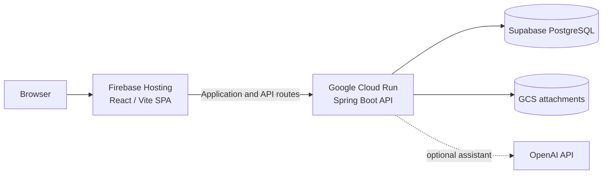

# LeaveMaestro Documentation

Welcome to the shared documentation site for LeaveMaestro. Choose the section that matches what you want to do.

-   :material-account-group:{ .lg .middle } **Using LeaveMaestro**

    ---

    User guides for employees, managers, HR, and tenant administrators. Learn how to sign in, manage leave, review requests, and use the features available to your role.

    [:octicons-arrow-right-24: Open the User Guide](user-guide/index.md)

-   :material-code-braces:{ .lg .middle } **Building & Operating LeaveMaestro**

    ---

    Technical documentation for developers, operators, and contributors covering architecture, APIs, security, development, deployment, operations, and Ask LeaveMaestro.

    [:octicons-arrow-right-24: Open Technical Documentation](technical/index.md)

## About LeaveMaestro

LeaveMaestro is a multi-tenant employee leave management application with a Spring Boot backend, a React/Refine frontend, policy-driven leave entitlements, configurable RBAC, deployment automation, and an embedded AI assistant.

The source code and both documentation audiences are maintained together in the [LeaveMaster GitHub repository](https://github.com/thecodinganalyst/LeaveMaster). The site continues to use one GitHub Pages deployment and one shared search experience. For the public product overview, visit the [LeaveMaestro website](https://leavemaestro.com/); for Singapore statutory-topic explainers, start with the [Singapore leave guides](https://leavemaestro.com/singapore-leave-guides).

## Technical architecture at a glance

For implementation details, continue to the [Technical Documentation](technical/index.md).

## Explore the product

Documentation explains how to use, build, and operate LeaveMaestro. The public website provides the product-level context around those workflows:

- [Leave management overview](https://leavemaestro.com/leave-management) — how policies, balances, requests and approvals fit together.
- [Singapore leave management](https://leavemaestro.com/singapore-leave-management) — jurisdiction-aware product configuration, with links to maintained Singapore leave guides.
- [Open-source LeaveMaestro](https://leavemaestro.com/open-source-leave-management) — project positioning, self-hosting context and the route back to this technical documentation.
- [Ask LeaveMaestro](https://leavemaestro.com/ai-leave-assistant) — product overview for the embedded AI assistant; use the technical docs for setup and security details.
