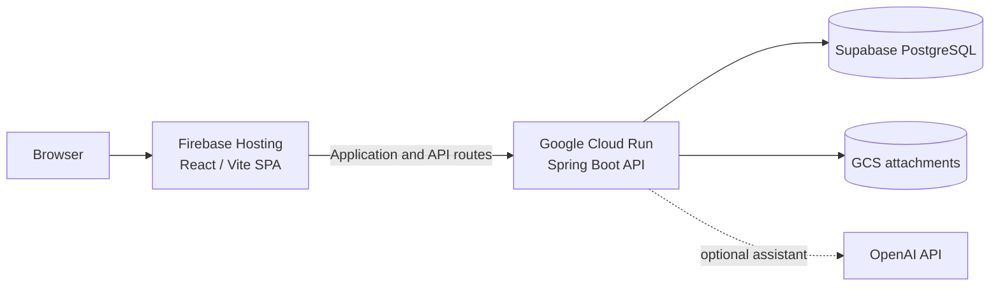

# LeaveMaestro Documentation

LeaveMaestro is a multi-tenant employee leave management application with a Spring Boot backend, a React/Refine frontend, policy-driven leave entitlements, configurable RBAC, deployment automation, and an embedded AI assistant.

This site is the technical documentation hub for developers and operators. Use the navigation to explore architecture, leave-management behavior, security, APIs, deployment, testing, and troubleshooting.

## Start here

- [Architecture](architecture.md) — system components, request flows, security boundaries, and deployment diagrams.
- [API documentation](api.md) — resource-level API notes and examples.
- [Policy-driven leave entitlement generation](leave-entitlement-generation.md) — eligibility, policy resolution, accrual, carry-forward, proration, and reconciliation.
- [Development and CI](development-and-ci.md) — local development, test gates, and GitHub Actions.
- [Cloud Run deployment](cloudrun-deployment.md) — production backend deployment and infrastructure setup.
- [Troubleshooting](troubleshooting.md) — common build, authentication, deployment, and assistant failures.

## Architecture at a glance

## Repository

The source code and documentation are maintained together in the [LeaveMaster GitHub repository](https://github.com/thecodinganalyst/LeaveMaster).
