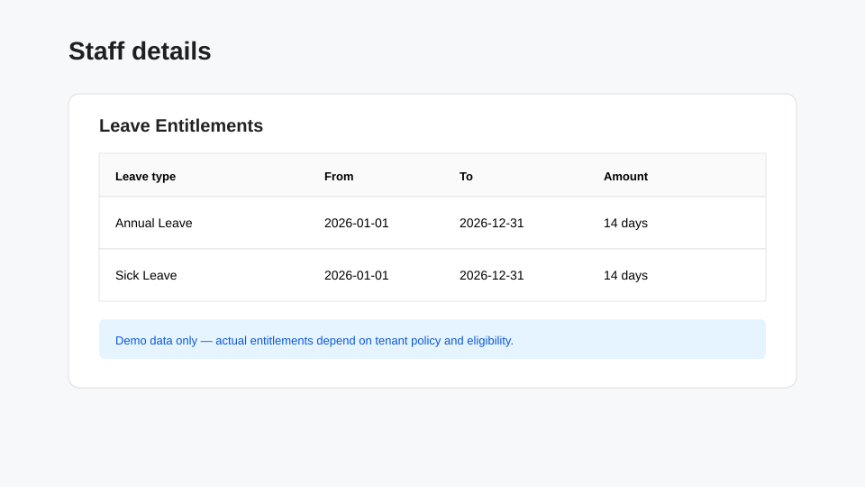
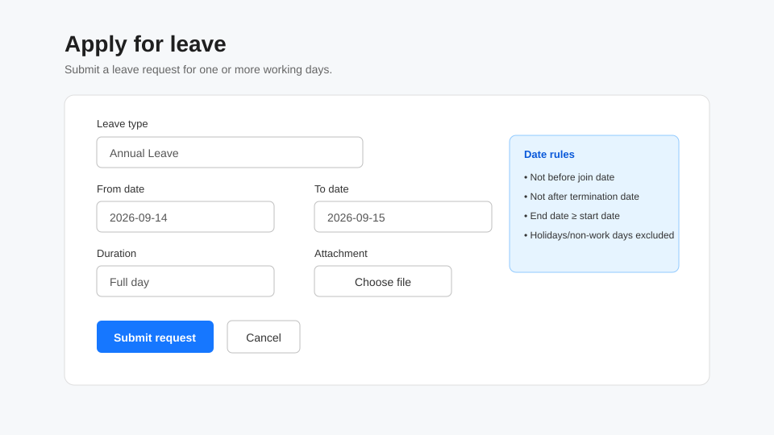

# Employees

Use this guide for everyday leave tasks. The exact leave types and balances available to you depend on your tenant configuration, jurisdiction, employment dates, work schedule and eligibility.

## View your staff information and leave entitlements

Open your staff record from the staff area available to you. The staff detail page shows your profile information, normal **Work Schedule**, and **Leave Entitlements**.

For each entitlement, review the leave type, validity period and amount shown. If an expected entitlement is missing, contact HR rather than creating or changing policy data yourself.

## Apply for leave

1. Open **Leave requests**.
2. Select **Apply for leave**.
3. Choose a **Leave type**.
4. Enter the **From date** and **To date**.
5. Choose **Full day**, **Morning half day**, or **Afternoon half day**.
6. Add supporting evidence when appropriate or required.
7. Select **Submit request**.

For a multi-day range, LeaveMaestro excludes non-working days and public holidays using the configured work schedule and leave calendar.

### Dates you cannot use

The date fields are limited by your employment dates. Leave cannot be requested before your join date or after your termination date, when a termination date exists. The form also rejects an end date earlier than the start date.

### Event-based leave

Some leave types require a qualifying event. When one is selected, the form can ask for an **Event date**, optional start/end dates, and an optional event reference. If the policy requires verification, an attachment is required and the request may first enter a verification state before normal approval.

## View your leave requests

Open **Leave requests** to see leave visible to you. The table includes Staff, Date, Leave type, Duration and Status. Use the search box to filter by leave type, date, status or staff, and select **View** for request details.

Common statuses include:

| Status | Meaning |
| --- | --- |
| Pending | Submitted and awaiting the next approval action |
| Pending verification | Waiting for required qualifying-event verification |
| Approved | Approved through the configured workflow |
| Rejected | Rejected by the assigned approver |
| Cancel requested | A cancellation is waiting for approval |
| Cancelled | The request has been cancelled |

The exact status options shown depend on the request lifecycle.

## Cancel or withdraw leave

Open the request from **Leave requests** and use the cancellation action when it is available. Whether cancellation can happen immediately or requires approval depends on the current request state and configured workflow. If no cancellation action is shown, the request is not currently cancellable through your permissions/state.

## View the leave calendar

Open **Leave Calendar** to review the calendar information available to your role. Staff and manager access is view-oriented; calendar configuration actions are reserved for roles with the required write permission.

## If something looks wrong

See [Troubleshooting](../troubleshooting/index.md) for missing leave types, unavailable dates, entitlement questions and submission errors.
