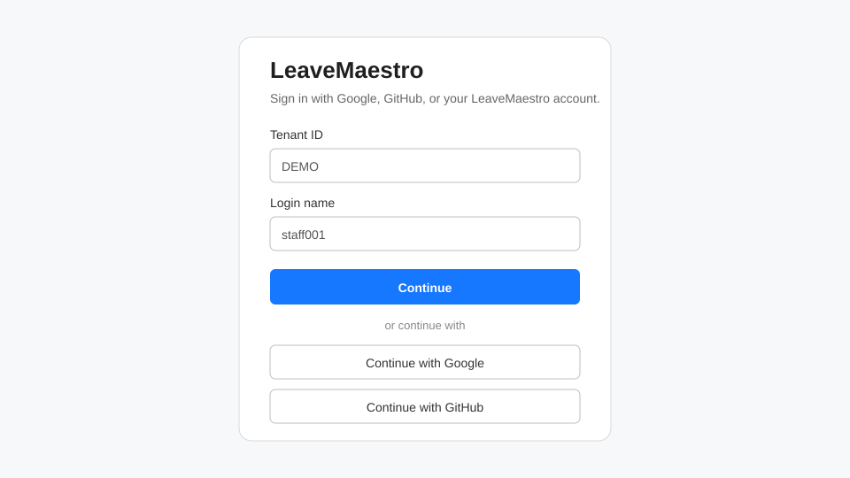

# Getting Started

LeaveMaestro helps employees request leave, managers review requests, and HR/tenant administrators maintain staff and leave configuration. The options you see depend on your assigned role and permissions.

## Sign in with your LeaveMaestro account

1. Open the LeaveMaestro sign-in page.
2. Enter your **Tenant ID** and **Login name**.
3. Select **Continue**.
4. If your account is already activated, enter your password and select **Sign in**.

Tenant ID and login name identify your account. LeaveMaestro does not provide a tenant picker on the login page.

## Activate your account for the first time

If LeaveMaestro tells you that the account needs to be set up:

1. Select **Send verification PIN**.
2. Check the email address registered for your account.
3. Enter the 6-digit PIN. The current PIN expires after 15 minutes.
4. Select **Verify PIN**.
5. Enter and confirm a permanent password of at least 8 characters.
6. Select **Activate account**.
7. When **Account activated** appears, select **Continue to sign in** and sign in with the new password.

A resend option becomes available after the displayed cooldown period.

## Sign in with Google or GitHub

The sign-in page also offers **Continue with Google** and **Continue with GitHub**. These buttons work only when that provider account has already been linked to your LeaveMaestro account.

If the provider is not linked yet, sign in with your LeaveMaestro account first and use **Security** to set it up. See [Account & Security](../account-security/index.md).

## Understand your role

LeaveMaestro shows only the pages and actions allowed by your permissions. Typical responsibilities are:

| Role | Typical use |
| --- | --- |
| Staff / Employee | View own staff information and entitlements, submit leave, review leave history, view the leave calendar |
| Manager / Approver | Employee functions plus review/approval of requests assigned to them and permitted team visibility |
| HR | Staff administration, entitlement review, approver setup and HR-managed leave information |
| Tenant Administrator | Tenant-level staff, roles and leave configuration administration |

Your tenant may assign a different combination of permissions, so the navigation can differ from these examples.

## Evaluation environment notice

The project-hosted LeaveMaestro environment is for temporary testing and evaluation. Use fictional or non-production data only; do not enter real employee or personal data.

Next: choose the guide for [Employees](../employee/index.md), [Managers](../manager/index.md), [HR](../hr/index.md), or [Administrators](../admin/index.md).
