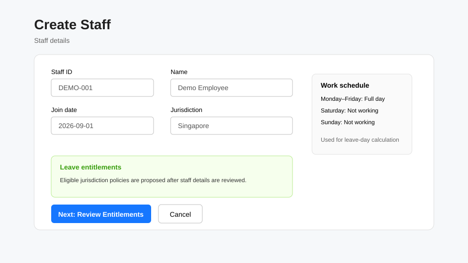

# HR

HR users maintain staff records and the leave information permitted by their role. Your tenant can customize permissions, so only use actions shown to your account.

## Create a staff member

1. Open **Staff** and select **Create**.
2. Enter the required **Staff ID**, **Name** and **Join date**. Add email and login name where applicable.
3. Choose the staff **Jurisdiction**. Only jurisdictions backed by a configured tenant leave calendar are offered; if only one is configured, LeaveMaestro can preselect it.
4. Set the normal **Work schedule** for Monday through Sunday. Choose Full day, AM, PM or Not working for each day.
5. Select **Next: Review Entitlements**.
6. Review the generated **Leave entitlements**. LeaveMaestro proposes them from the applicable jurisdiction policy templates and the staff details entered above.
7. Adjust the proposed leave type, validity dates or amount only when your organization requires it, or add/remove an entitlement where appropriate.
8. Select **Confirm & Create Staff**.

If LeaveMaestro reports that no leave-calendar jurisdiction is configured, create/configure the tenant leave calendar before creating or moving staff into that jurisdiction.

## Understand entitlement proposals

The proposal can show three broad outcomes:

- **Available** — eligible policy templates produced proposed entitlements.
- **No template** — no applicable entitlement policy template is configured for the selected staff/jurisdiction.
- **Not eligible in period** — templates exist, but the staff member does not qualify in the current calendar period.

Review the join date, termination date and jurisdiction before overriding a proposal.

## Add dependants

Where the staff workflow exposes dependant information, add the dependant facts needed by the organization's configured eligibility rules, such as relationship and relevant dates. Only record information that is required for the leave process, and use fictional data in the hosted evaluation environment.

## Configure leave approvers

Use **Leave Approvers** or the approver controls available from staff management to associate a staff member with an approver and the applicable effective start/end dates. Avoid circular/self-approval relationships. Multiple records can be used when an approver changes over time.

## View and maintain staff information

Open a staff record to review profile data, assigned roles, Work Schedule and Leave Entitlements. Whether an **Edit** action appears depends on your permissions. Staff themselves can view their own staff information but should not be expected to maintain HR-controlled fields.

## Leave configuration relevant to HR

Depending on assigned permissions, HR may be able to review or maintain leave entitlements, approvers and related configuration. Tenant-wide policy/role administration may be reserved for Tenant Administrators.

See also: [Managers](../manager/index.md), [Administrators](../admin/index.md), and [Troubleshooting](../troubleshooting/index.md).
