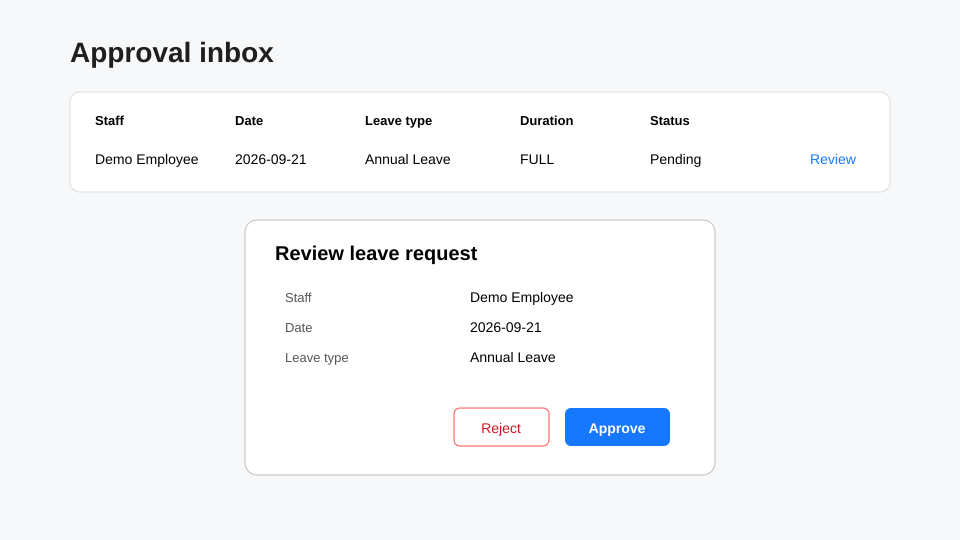

# Managers and Leave Approvers

Managers can use their normal employee functions and, when they have approval permission and are configured as an approver, act on leave assigned to them.

## Review requests awaiting your action

Open **Approval inbox**. The page lists pending leave requests and cancellation requests assigned to you, with Staff, Date, Leave type, Duration and Status.

1. Find the request you want to review.
2. Select **Review**.
3. Check the staff member, date, leave type, duration, status and applied date.
4. Select **Approve** or **Reject**.
5. Wait for the success message confirming that the action was processed.

The current approval screen does not collect approver comments. If your organization needs a comment/reason, follow its separate process.

## Cancellation requests

A leave request with **Cancel requested** can also appear in the approval inbox. Review it the same way, then approve or reject the cancellation request.

## View team leave

Open **Leave requests** or **Leave Calendar** for the team information made visible to you. Visibility is determined by LeaveMaestro's backend permissions and approver relationships; a manager does not automatically see every employee in the tenant.

## Manager permissions versus HR/Admin

Manager access is primarily for reviewing leave and viewing permitted staff/team information. Configuration tasks such as maintaining leave calendars, entitlement policies, tenant roles or broad staff administration require the relevant HR/Admin permissions. If an edit/create action is not shown, your account does not currently have that permission.

## No requests in the inbox

**No requests awaiting action** means there are no pending leave/cancellation requests currently assigned to your staff record. If you expect one, confirm with HR that the leave approver assignment is active for the relevant employee and effective dates.

See also: [Employee guide](../employee/index.md) and [Troubleshooting](../troubleshooting/index.md).
